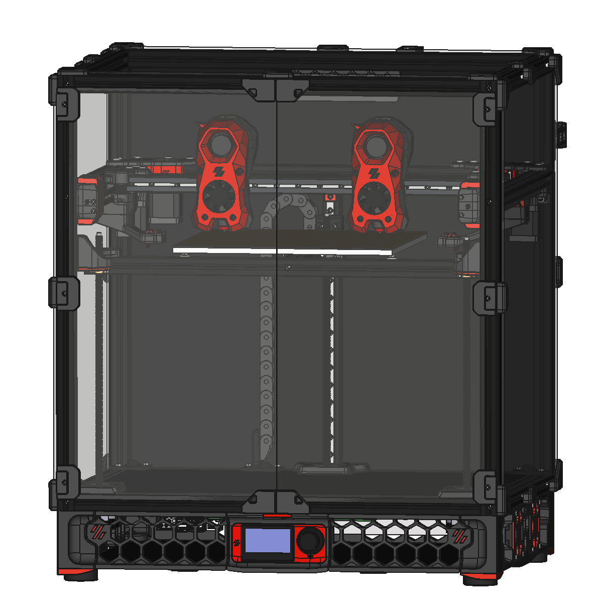

# Tridex

## Overview

The primary purpose of this IDEX (Independent Dual EXtrusion) printer is to enable dual material prints for soluble/removable supports (ie, ABS primary material + HIPS support material). Other methods of printing dual materials within a single toolhead (such as using a Y splitter, MMU, Palette, etc) have issues due to mixing/contamination within the nozzle which may cause poor layer adhesion. As well, these methods require fairly substantial purge blocks, which generally can be avoided with an IDEX design. 

If you need to prototype parts that have complex geometries (ie, prototyping parts that will be injection molded for mass production), this may be the printer for you! However, if you are designing parts with the final goal of being 3d printed, optimizing the design to be printed without supports will be more reliable, less expensive, and faster overall.

While this printer *may* eventually be "release worthy" with supporting documentation, please note **this is an advanced DIY 3d printer build.** This should not be your first DIY 3d printer, or your first Klipper 3d printer. There is a substantial amount of firmware configuration, macros, slicer setup, tuning, and calibration needed to get from a physically built printer to reliable multi material printer. 

## Specifications

Build Area 250 (300): 

- Single Toolhead: 225x250x250mm (275x300x250mm)
- Dual Toolhead: 205x250x250mm (255x300x250mm)

Maximum Acceleration:

- Recommended 2000-4000 mm/s^2

This printer is based on the official Voron Trident release files: https://github.com/VoronDesign/Voron-Trident/releases
